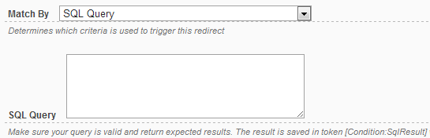

# Database Data

This type of redirect allows specifying an SQL Query that returns a scalar. Then, evaluate the scalar to determine either the redirect will be executed.

Note that the SQL Query input support My Tokens, which means you can mix anything in the query, for example information about current user or the application state.

There are a few ways you can write the SQL:

* select statements 
For example: *select SomeField from SomeTable where SomeCondition=1*

* stored procedure 
For example: *EXEC SomeStoreProcedure 'this is the param'* 
The store procedure needs to do a similar select to return only 1 value.

* Function 
For example: *SELECT dbo.SomeFunction('this is the param')*

The result of the SQL is saved under a token called [Conditions:SqlResult].
You can use this in the URL or other actions.

## Operations

This type of redirect supports both number and text operators.