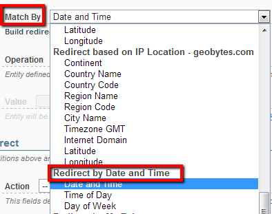
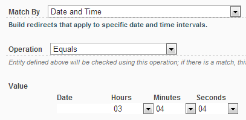
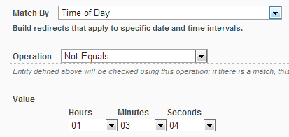
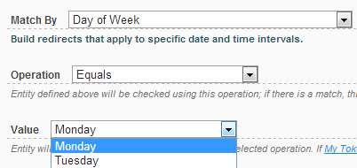

# Date and Time

This type of redirect allows building redirects that apply to specific date and time intervals.

## Properties

Following properties are exposed:

* Date and Time

* Time of Day

* Day Of Week

