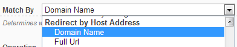

# Host Info

This type of redirect makes it possible to direct based on URL of current page.

## Properties

Following properties are exposed:

* Domain Name - This property exposes only the domain part from the URL making it easier to write conditions where domain equal some value. For example, on this page this Property would return *redirect-toolkit.dnnsharp.com*
* Full URL - This property exposes full URL, including scheme (http:// or https://), port, domain, path and query string parameters.

## Operations

Both Properties are of type string and therefore support all string operators.