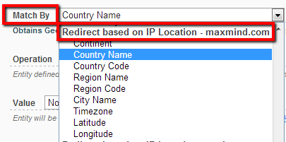
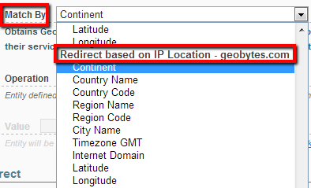

# IP Geo Location

Starting with version 1.8.0 Redirect Toolkit support redirects based on Geo Location information such as the country name or longitude coordinates. This is accomplish by integration with Geo Bytes  and Maxmind.

**Note that Geo Bytes offer up to 20 free checks per hours**. If you exceed this limit you have to purchase their service and fill in the username and password in Redirect Toolkit Global Settings.

**Important**: Use My Browser Capabilities Tool at the end of the Manage Screen to see what information Geo Bytes has about your location. Note that if you test your site on localhost or on intranet IP then the information returned by Geo Bytes is NOT relevant.

Max Mind comes with two flavours: Country Service and Omni Service. The Country Service only returns the country code for a given IP. This means that matching by any other field will fail.

## Properties

Redirects IP Geo Location expose following properties:

* Country Name
* Country Code
* Region Name (state for USA)
* Region Code (state Code for USA)
* City Name
* Timezone GMT (format is *-/+hh:mm*)
* Internet Domain (.us, .au, .ro, etc)
* Latitude
* Longitude
