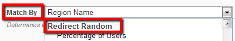

# Random

Random redirects allow redirecting a percentage of users to target URL. Note that this is not exactly random, you get to specify a percentage for the redirect to happen. So for a very large number of visitors this rule actually says *Redirect N% of the users*. But you don't get to specify which users to redirect so for the targeted users this is random.

## Properties

There is only one property exposed, that is **Percentage of Users**

## Operations

Only one operator is available for this rule, the **Equals** operator. Being a probability, you can't actually use greater or less operators because the probability only becomes the absolute value for an infinite number of visits.