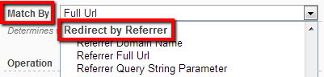

# Referrer Info

This type of redirect provides capabilities to match based on where the user came from. This gives flexibility to create portals based on referrals, partners, commissions, etc. Note that there is also an additional action to Save the Referrer that is quite powerful and can be used in conjunction with other redirect types a well.

Common scenarios when this type of redirect is needed include:

* Redirect to different pages based on where the user came from (you can accomplish this by creating a rule that matches against the referrer full URL or just the domain name)
* Customize portal appearance based on referrer (it's common for example to change the logo based on the referrer; this can be accomplished with any type of rule by using the Save Referrer option then have the UI code render based on the saved value; if that's not possible, use this type of rule to redirect to already customized pages)
* Control internal workflow by redirecting users to subpages based on the page they came from (the referrer also works for internal pages, so you can actually determine the page the user came from; based on this, you can transparently redirect the user to see one page or another)
* Trigger special behavior for user that just arrived on the portal (you accomplish this by checking the referrer domain against portal domain, if it's not the same then the user just arrived on the portal)