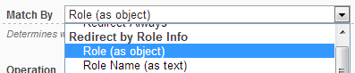

# Role Info

This type of redirect provides capabilities to redirect based on DotNetNuke Roles associated to current user.

Common scenarios when this type of redirect is needed include:

* After login, redirect users based on roles to different pages from the portal (you accomplish this by setting DNN to redirect to specific page after login; that page would have the Redirect Toolkit module that send each user to appropriate page)
* Enforce workflow, so even if users have visibility to some pages, they need to complete some other action first (you accomplish this by adding a Redirect Toolkit module to the page that you want to make sure the user has completed some action which reflects in the roles they belong to; so the action itself would add the role that bypasses the redirection rule)
* Count how many of each relevant roles access a page (you accomplish this by adding a Redirect Module to the page, setup a rule for each of the relevant roles and set each one to count redirects; the redirect action you have to set to Keep on Current Page)
* Interact with components on the page differently based on roles (you accomplish this by setting the rules to save arbitrary values in the Browser Cookies/Server Session/User Profile that you know the component will use)

## Properties

There are two property exposed, **Role (as object)** and **Role Name(as text)**. The difference between them is the second interprets roles as text (and therefore you can do string operations) while the first logically identifies the role by selecting from existing roles.

To make this clear, let's follow a simple example: redirect users that belong to a role called *Paid Viewers*.
If using the first option, you'd be presented with a dropdown with all existing roles and you'd have to set the operation to **Is In Role** and select the Paid Viewers role in the roles dropdown below.

If using the second property (Role Name), you'd set the operation to *Any Equals* and type *Paid Viewers* in the textbox that appears below. Remember that a user usually is in more that one role, so the *Any Equals* operation basically translates to *Any of the user roles equals...*

The second property gives you ability to achieve more complex scenarios, such as when you want to match parts of the role name (for example you want to redirect all users that contain *Paid* in their role name, either they're in *Paid Viewers* or *Paid Members roles*.

## Operations

* **Role** Property
    * **Is In Role** - true if current user is in the role selected in the value dropdown
    * **Is Not In Role** - true if current user is not in the role selected in the value dropdown
* **Role Name** Property
    * **Any Equals** - true if any of the current user's roles equal text typed in the value textbox; same a Is In Role operation of the Role Property
    * **ALL Don't Equal** - true if none of the current user's roles equals text typed in the value textbox; same as Is Not In Role operation of the Role Property
    * **Any Contains** - true if any of the current user's roles contains text typed in the value textbox; the text can appear anywhere in the Role Name (beginning, end, middle, etc).
    * **ALL Don't Contain**- true if none of the current user's roles contains text typed in the value textbox