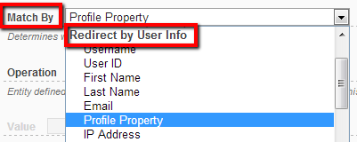

# User Info

This type of redirect provides capabilities to match based on user information such as username, user id, first&last name, email or profile property.

Common scenarios when this type of redirect is needed include:

* Redirect individual users to specific pages (you accomplish this by matching the username or user id which are known to be unique)
* Redirect to different page based on user preferences (for example, you could maintain a Start Page profile property that can have following values: Home Page, My Account Page, News; users will be able to change this. To accomplish this, configure DNN to redirect to a specific page after login and on that page add a Redirect Toolkit module with rules to match possible values of the Start Page profile property).
* Interact with users of your portal by redirecting them to specific pages when you require additional actions from them or you need to pass some information specific to that user (you accomplish this by creating rules against user ids or private profile properties that you manage and remove the rule or reset the profile property after the user has completed the action)
* Redirect only users subscribed before a certain date (you accomplish this by creating a rule that matches all user ids less than the integer value you know to be at that date - note that this is possible because user ids are sequential)