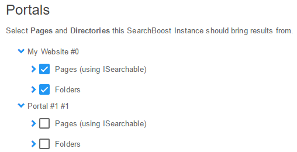

#### Targets

Search Target allows you to have a Search Instance return results specific to the subcategory of the portal pages and folders. It tells SearchBoost what to search for. Users select pages and directories for the SearchBoost Instance. Search results are then retrieved from the pages and directories selected by the users.

**Open Search Target**

1. To define pages and folders for a Search Boost Instance login with a Super User Account.

2. Then go to the Manage menu of the avt.searchboost.input module in the portal and select the Search Settings link. You will be taken to the Search Boost Control Panel.

3. Then click Search Target in the Search Boost Control Panel. It will open the Search Target main page.

**Search Target Main Page**

On the search target main page you can select specific pages and folders for displaying search results. It allows different Search Boost Instances to be configured for different results. 

You are able to select Pages and Directories for a Search Boost Instance from the Portal menu. The portal menu has a list of pages below the Portal Pages category and a list of folders in the Portal Home Directory category. When you select Portal Pages all the pages listed in Portal Pages are selected. The same event happens when the Portal Home Directory category is selected. All the folders in the Portal Home Directory is selected.

Below the Portal menu there are two features for enhancing the search, Add URL and Exceptions.

You can also filter the pages and folders using the Further filter search results to... option next to the portal menu. A filter is applied dynamically based on the active page. This is only relevant if the same search input box appears on more than one page, for example the same ModuleId or the same Skin Object.

**Create a Search Target**

1. To define which modules and folders a Search Boost instance should search go to the Portal menu on the main page. It looks like the following image.

2. Then select the pages and folders you want to bring the search results from. Your selection depends on the Module Security and Folder Permission. 

3. To expand or collapse a specific root page or directory click on the arrow to the left of the each root page or   
 directory. You will see a list of items associated with the selection.

4. The items listed in each Portal page are child pages and are specified as modules on this page. The items listed in the Portal Home Directory is specified as documents in this folder. When you select a root page (for example Home) or directory (for example Users), the child pages or folders listed are automatically selected. If you want to deselect them expand the root page or folder. When you check a page or folder you will notice a check mark appear in the check box next to the item.

Note: All the levels below each page is also child pages. Select only the pages or folders you want to bring the search results from. 

**Add URLs**

1. Select Add URLs link to specify additional URLs that SearchBoost can use to crawl and extract content. The link will open the Search URL screen.

2. On the Search URL use the input text field to input the URL.

3. You can input URL for pages, sitemaps and RSS feeds. The page links you input do not have to be on the same website. If you specify a URL that points to a sitemap or RSS Feed, SearchBoost will automatically detect the sitemap or RSS Feed and pass all the pages associated with the sitemap or RSS Feed.

When you are done inserting the URL in the text field, specify how high you want to rank the Search URL using the Boost option.

The Boost options listed are: 

  * No Boost
  * Moderate Boost
  * High Boost
  * Very High Boost
  * Extreme Boost

4. When you are done click Save.

**Create Exceptions**

1. Select the Exceptions link to input an exception. The link will open the Exceptions screen. 

On the Exceptions screen there are three tabs for inputting exceptions, Except Tabs, Except Modules and Except Folders. In the text area of each tab only one entry per line is allowed. If you are inputting a regular expression use the format /regular expression/.

2. Select Except Tabs to input Tab Id number, sub strings of the title or name, or a regex (regular expression). 

3. Select Except Module to input module sub strings, module numbers or a regex (regular expression).

4. Select Except Folders to input a sub string of a folder, file name or a regular expression.

5. When you are done click Save.

**Filter Search Results**

Next to the Portal menu is an option that allows you to filter search results. It is the Further filter Search results to... option. You can use this option to filter the search results for the pages and folders selected in the Portal menu.

1. Click on the Further filter Search results to... drop down box to specify an additional filter for your page.

When you select a filter option it is applied dynamically based on the active page. It is only relevant when the same search input box appears on more than one page, such as the same ModuleId or Skin Object. 

  * **Don't Filter (display all results)**
Select this option if you do not want to filter pages for search results. This option will display all search results.

  * **Results from active page**
Select this option if you want to bring search results from an active page. This option will only filter results from the selected portal page.

  * **Results from children of active page**
Select this option if you want to bring search results from child pages of the portal page selected.

  * **Results from active pages and all child pages**
Select this option if you want search results from the selected portal page as well as the child pages of the selected portal page. For example, if you select the User Profile page below Portal pages, search results are filtered for the User Profile page as well as all the child pages of the User Profile page.

  * **Results starting from ROOT item of active branch**
Select this option if you want to bring search results for all the folders within the Portal Home Directory. This means if you select Portal Home Directory, search results will be brought from all its folders.

  * **Results starting from level 1 item of active branch**
Select this option if you want search results filtered for all the folders from the first folder of the Portal Home Directory.

  * **Results starting from level 2 item of active branch**
Select this option if you want search results filtered for all the folders from the second folder of the Portal Home Directory.

  * **Results starting from level 3 item of active branch**
Select this option if you want search results filtered for all the folders from the third folder of the Portal Home Directory.
When you are done click on Save the Target, located below the Portal menu. 