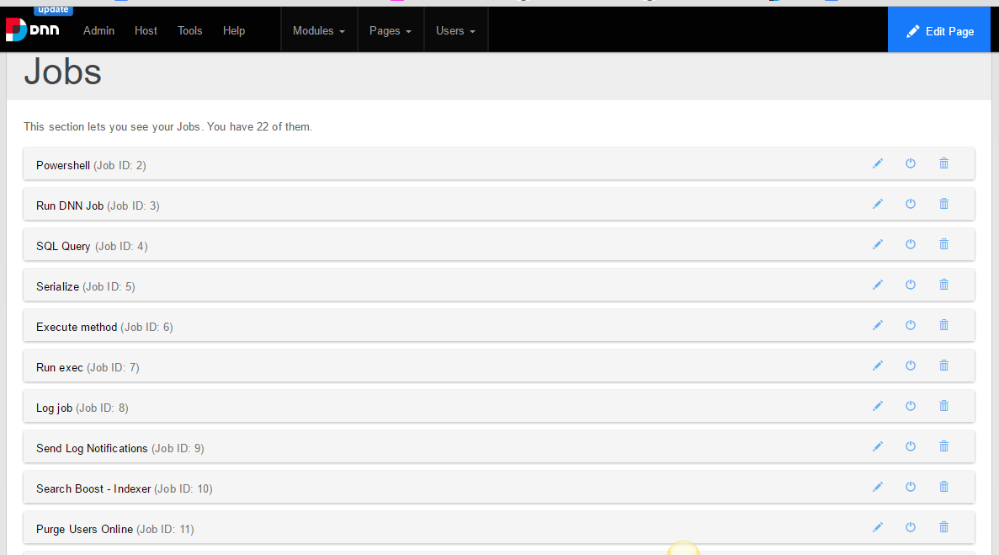
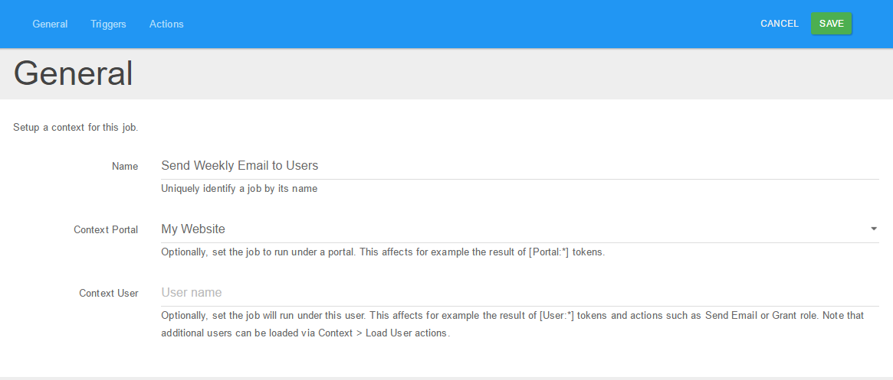
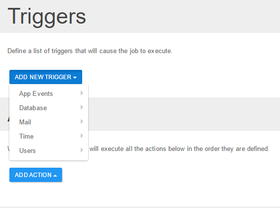
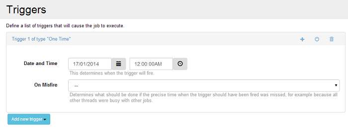

# What is Sharp Scheduler?

Sharp Scheduler is a time-based and application events-based task scheduler module for DNN.

It allows for an easy way to manage, schedule and execute actions such as: run SQL Queries, DNN jobs, executables, PowerShell scripts, Post Data, send emails and execute methods automatically and periodically at specific times/intervals (time triggers, interval triggers, cron triggers) or when an event occurs (on application start/end, at the beginning/end of every request).

### Key Features:

**Enterprise-Focused**

At DNN Sharp, we want pricing that is simple, straightforward, fair to the typical user and fosters adoption across your organization.  

**Extensions Framework**

Sharp Scheduler can be extended and customized as per your own needs from a minor utility that carries a simple task to a full-blown application that performs many complex actions. 

**DNN Schedule Migration**

If you have specific tasks added to the DNN schedule, don’t worry; with Sharp Scheduler you are able to migrate them.

**Requirements**

+ DNN 6+
+ SQL Server 2005+ (including msde and express editions)
+ ASP.NET 4.0+
+ IIS 7.0+

**Support**

Our support staff is friendly and always available to help you. Engage us on our [community platform](http://www.dnnsharp.com/support){:target="_blank"}.

You can download the latest version of Sharp Scheduler from [www.dnnsharp.com](http://www.dnnsharp.com/dnn/modules/sharp-task-scheduler/download){:target="_blank"}. While on that page, you can also check the changelog to see what's new.

# Getting Started

This section guides you through setting up Sharp Scheduler. Let's say you want to send an e-mail once at a specified date and time.

+ Before you proceed, make sure you have Sharp Scheduler installed on your portal. You can download it from the Sharp Scheduler [download page](http://www.dnnsharp.com/dnn/modules/sharp-task-scheduler/download){:target="_blank"} and install it from Host > Extensions.

+ Create a page and add Sharp Scheduler as you normally would any other module, then locate and click the New Job button in order to create a new job.

+ Provide a unique name for your job

+ Locate the Add New Trigger dropdown button and choose the One Time option from the Time category. Notice that there is no limit on how many triggers a job can have.

+ Define a desired time for your job to be executed

+ In this scenario, we want to send an email to a specific email address. In the Actions section, click the Add Action button, then select Email > Send Email.

+ Add the required information for your email to be sent.

And...that's it! Make sure to save your settings.

Congratulations, you scheduled your first task!

We recommend that you browse the rest of the documentation and experiment with various options.

Meanwhile, check out the video tutorial below which is our step-by-step user guide to get started with Sharp Scheduler!

{:target="_blank"}