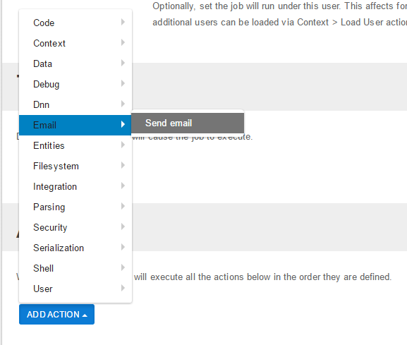
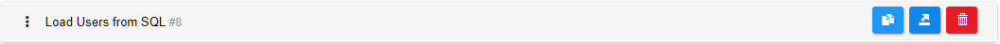
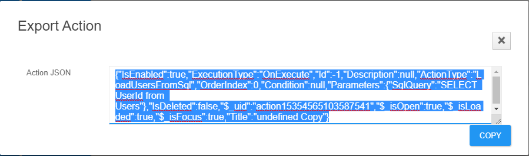
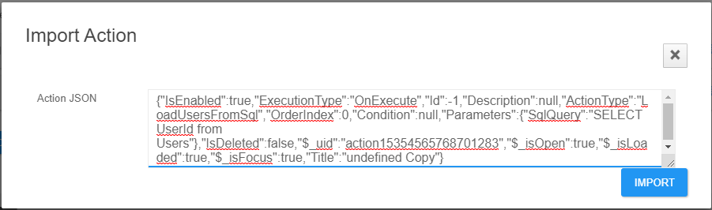

# Actions

When a trigger fires, Sharp Scheduler runs the respective job. This means that all actions in a job are executed in the specified order. If any action fails, the execution stops and the job is considered to have failed. This is shown in the job Last Ran section as well as in [History](../history.html). An action fails if an exception is thrown. This can be deliberate to indicate a certain state such as a missing or invalid parameter, but they can also be unexpected and sometimes even obscure. Make sure to read the section on [Debugging](../debugging.html) to see how errors can be tracked down.

Sharp Scheduler comes with a dozen different action types and again, the order in which they are added to the list matters a lot for a few different reasons. First of all, Sharp Scheduler provides a shared context where Actions can store their data. This means that actions at the top can provide data for other actions down the stack to use. Think for example an SQL Action with an ``INSERT`` statement saving the ID of the newly created entity so that it can be further used to execute an initialization method using the Execute Method action.

If an action fails, the execution stops and the job is marked as failed. This means that some actions will get to execute before the error is thrown. It's therefore a good strategy to place the actions that are easier to undo at the top. If they fail, it's easier to roll back and recover when needed.

It's also worth mentioning that Sharp Scheduler providers a framework for new types of actions to be plugged in. Make sure to check the *Extensions* pages for more info.

## Importing an action

It is worth noting that you can import any action from another DNNSharp product based on actions, such as Action Form or DNN Api Endpoint.

You can do so by clicking the *Copy* button on any action, then copying the JSON.

Afterwards, you need to press the *Import Action* button and paste the copied JSON.

The rest of this section goes through each of the core actions that ship with Sharp Scheduler.
