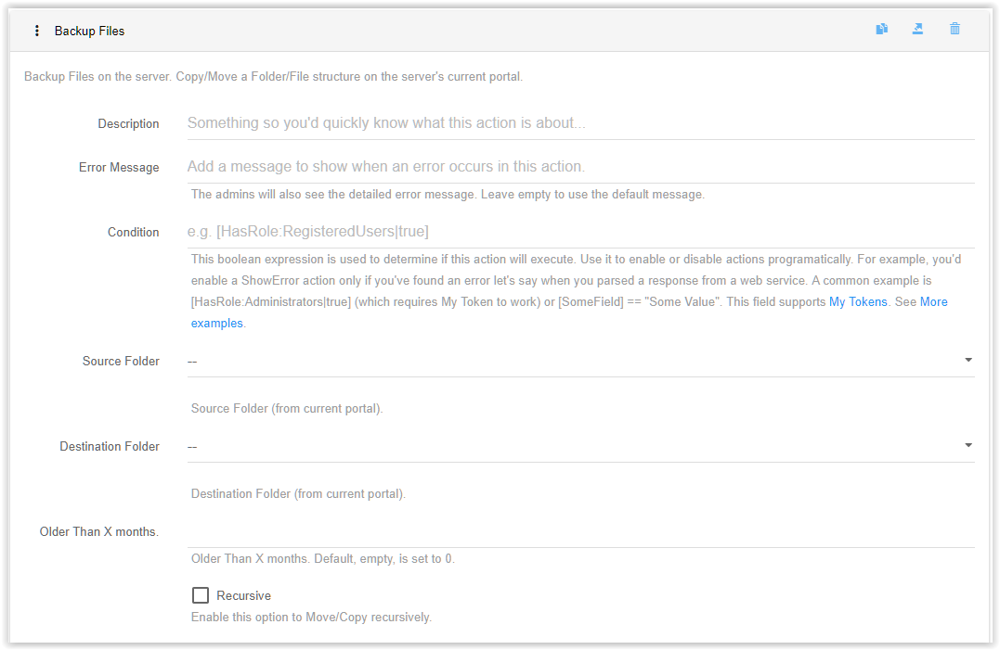
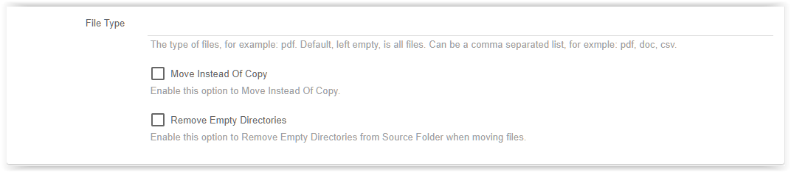

# Backup Files

This actions copies or moves files on the server's current portal

* You need to select the Source folder of the files and the Destination folder from the dropdowns.

* You can select only those files that are older than a certain number of months in the next field.

* Files/Folders can be copied recursively (meaning it will also copy files from subdirectories).

* If you want to copy a cartain type of files, mention them in a comma-separated list of values, like this: ``.pdf,.txt,.docx``.

