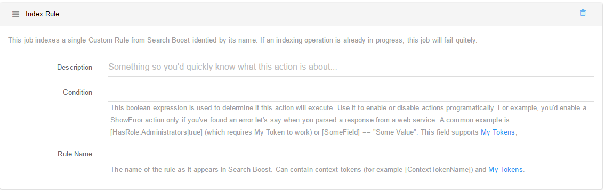

# Index Custom Rules

This actions lets you execute an individual custom rule just by knowing its name. It accepts context tokens (for example [ContextTokenName]) and My Tokens.

Also note that Custom Rules in Search Boost can be configured to index incrementally using Last Modified and Is Deleted columns. Make sure this is working properly before creating a job that indexes a custom rule on a very small interval.

