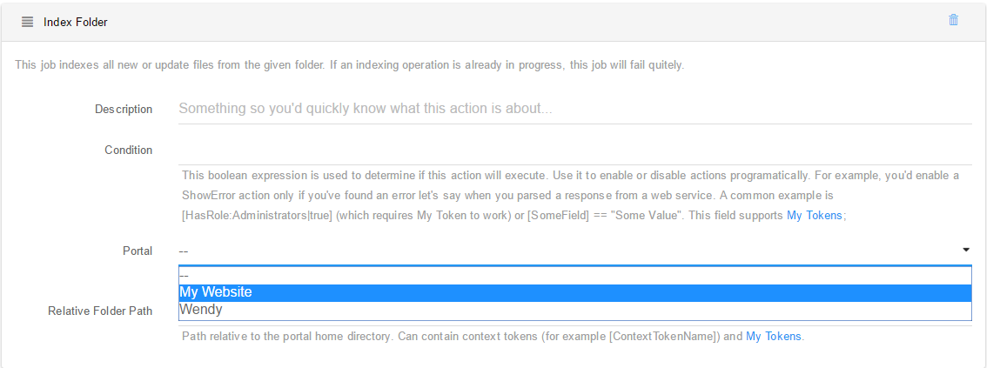

# Index Folders

This action can index an individual folder. This makes it very powerful to index particular folders on different schedules based on update frequency and importance.

This action can be configured with a Portal and a folder path relative to that portal. A future adjustment will eliminate the Portal parameter by taking it from the context.

Note that folder will still be subject to all Search Boost settings and DNN permissions just as in a normal full or incremental indexing. Also, the folder path can contain context tokens (for example [ContextTokenName]) and My Tokens.

Search Boost indexes documents incrementally, so usually there’s no need to worry about performances of this action.

