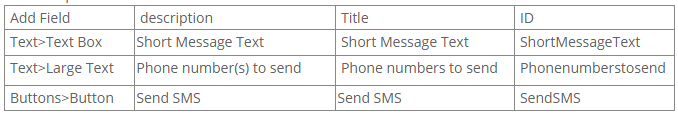

# Extensions

## Clickatell

**Getting Started:**

+ setup a Clickatell account (get the correct information from there)
+ download /install Sharp Scheduler
+ create a simple form
+ configure the Clickatell action
+ send a SMS
+ Settings Reference
+ short video

In order to use the Clickatell gateway you need a Clickatell account and at least one registered connection (API sub-product instance) between your application and the Clickatell gateway. Each connection method is known as a sub-product. You can follow these steps to get started:

Step 1 - Sign up for an account with [Clickatell](https://www.clickatell.com/register/?productid=1){:target="_blank"}

If you do not already have a Clickatell Central account, you need to register for one. If you already have a Clickatell Central account, proceed to Step 2 for instructions on how to edit an API connection on your account.

At "Which product would you like to sign up for?",
select "Developers' Central. Reliable, scalable, customisable. Integrates with your system via APIs."

Create an account:

When you sign up for a SOAP account you will be given a username, password and api_id: keep these at hand!
Once you have registered and been activated you will receive 10 free credits with which to test the service. Messages sent with these credits contain a canned (pre-populated) message. You can test the API using these credits, and purchase credits to start sending your own, customised messages.

An email containing your login details will be sent to the email address you have provided.
Please note that you will receive a clientID, which is not the same thing as the api_id.

Step 2 - [Login](https://www.clickatell.com/login/){:target="_blank"}

At "Which product would you like to log in to?",
select "Developers' Central. Reliable, scalable, customisable. Integrates with your system via APIs."

For:

What is your username?

What is your Client ID?

What is your password?

use your username, password, clientID received at step 1.

Step 3 - Add a SOAP API to your account

APIs > Set up a new API 

Add SOAP API

To add a SOAP API to your account select APIs from the main menu and then select Setup a new API from the submenu. Click the Add SOAP API button on the Setup API page that opens. You can then complete all the required details to configure your API.
After successfully adding a connection, a confirmation message will be displayed with a unique API ID and information on how to get started.

The getting started section displays the API connection parameters and authentication details. These details are required when connecting to the Clickatell gateway to send a message.

You will need this API's ID for Action Form. (not the SOAP API name). You can double check this API ID in the main menu: APIs > Manage APIs

Once you have the username, password and the SOAP API ID, you can proceed to the next steps. 

If you not already downloaded and installed Sharp Scheduler, you can do this now.
On your DNN website, add a new Sharp Scheduler module to the desired page.

At the initial configuration step, for demo purposes, we will choose a Blank Form.
It creates an empty form so you build everything from scratch.

Add three Form Fields: two Texts and a Button.
For example:

Add an Action Form with Clickatell; 

Configure the button On Click Handler:

Add Action:
Clickatell > Send SMS via Clickatell gateway

Here, you will use your username, password from Step 1 and the SOAP API ID from step 3 in the getting started with Clickatell section.
Once you're done, send a SMS to test the feature.

Settings Reference

+ API ID: Clickatell SOAP API ID.

+ Username: Clickatell username.

+ Password: Clickatell password.

+ Message: the Short Message that you intend to send, text or token.

+ Max. Length of the message: the maximum length of the message that the administrator intends to limit, must be an integer if set. If left empty, there is no limit imposed by the administrator. Be aware that there is a limit thou' imposed by Clickatell, 5355 characters. (SMS gateway technical  limits). The extension will truncate the text to this Clickatell maximum, even if field is left empty.

+ Phone number(s) to send TO: SMS messages need to be sent in the standard international format, with country code followed by number. No leading zero to the number and no special characters such as "+" or spaces must be used. For example, a number in the UK being 07901231234 should be changed to 447901231234. If you use Send Bulk, please use one phone number per line.

+ Send Bulk: When this option is set, all users receive the same message. This improves perforamnce, but users specific tokens will no longer be replaced.