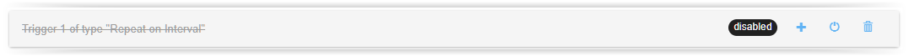

# Disabling jobs and triggers

You can temporarily disable a Job from executing by pressing on the *Disable* button in the main view of Sharp Scheduler

By doing so, you stop the job from being triggered by any of the *Triggers* you defined, but it can stil be manually run by
pressing on the *Run Now!* button.

You can also disable an individual trigger for a job, making Sharp Scheduler ignore it completely.

