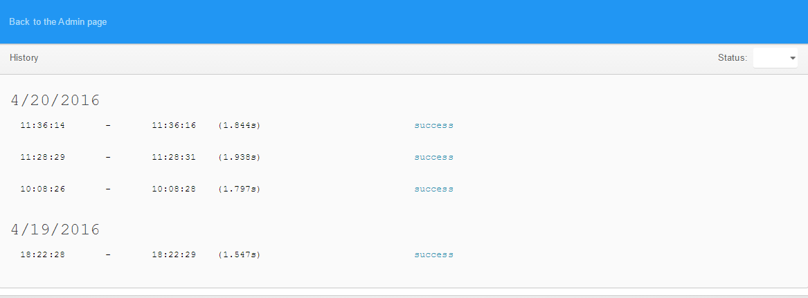

# History

The history of job executions is accessible through the "History" button in the job's extended details (the collapsible area below each job row), in the "Jobs" administration page. The last run time and status can be seen in the same extended details and also, in the case of a failure, the error that stopped the normal execution of the task.

The "History" page shows the times when the task was running, its duration and its final status (success, failure or unknown), ordered by day. Older logs are accessible through the "Load more" button, disabled after the last one was shown. To see even more details you may click the event that interests you to open the collapsible area. You can return to the main "Jobs" page through the "Back to the Admin page"  top button or by using the browser's "Back" button itself.

