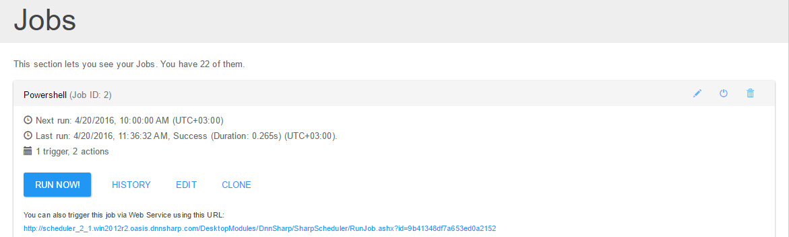
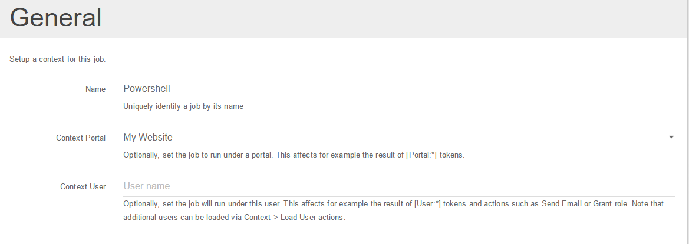

# Jobs

A job represents a set of instructions (called [Actions](actions/actions.html)) to execute when certain events occur (named [Triggers](triggers/triggers1.html)).
There is no limit on how many actions and triggers a job can have.

When you add a Sharp Scheduler module to the page, the first thing you will see is the list of existing jobs and the buttons to create new jobs or [import them from DNN](migrate-from-dnn-scheduler.html).

The list of jobs on first screen, when collapsed, will show the Job Name followed by when they are scheduled to run next between parenthesis. Further to the right there are buttons to Edit, Disable or Delete a job. While a job is disabled, Sharp Scheduler will prevent it from executing under a schedule or on various events. But you can still execute it manually if needed.

If you click on the Job Title the accordion will expand to show a quick overview of the job. The first thing you'll want to know is the status, that is when did it ran last and what was the outcome. Based on this you may want to take action either to fix the underlying issues if the job failed or optimize it if it takes too long.

There are 2 other important functions in the job overview panel. They refer to the ability to run a job independently of triggers, either by clicking the Run Now button or by using the Web Service URL.

**Job Context**

One important concept in Sharp Scheduler is context. At a minimum a context is data shared between actions. So one action can basically save data in context for other actions down the stack to use.

But more context can be given to a job from the Job Edit screen.

Notice the Portal and User context options. Right now, Sharp Scheduler is a Host module - that is the same set of jobs exists for all portals and Super Users manage them. But it's still possible to have a job execute under a portal using the ``Context Portal`` setting. That gives a meaning to the ``[Portal:xxx]`` tokens as well as file paths, page listings, user listings and so on, i.e. everything that comes under a portal.

Additionally, it's possible to also specify an user. If the ``Context Portal`` is also set, then the user must exist on the selected portal. Having specified an user, Sharp Scheduler will give meaning to User tokens as well as restrict access to resources based on that user permissions.