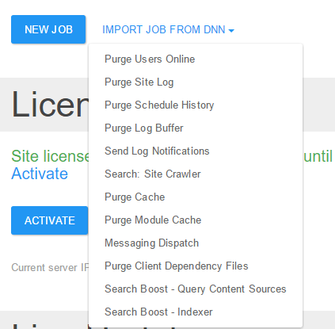

# Migrate from DNN Scheduler

We offer you the possibility to import the tasks from the DNN scheduler so you can use only one administrative interface. There are two ways to reuse the DNN scheduler tasks: import them or add them manually. Both are discussed below, but, essentially, the second choice does nothing in addition, except for the extra work, of course.

## Import Job from DNN

In the Jobs administrative page, under the list of tasks,  there is the "Import Job from DNN" button that, when used, will show a drop-down with all the jobs in the DNN scheduler, enabled or not (see the image below). Once imported, the task will be disabled in the DNN scheduler so it would not run twice.

## Add a DNN job manually

In the Jobs administrative page, choose "New job" and in the job details page add a new action "Integration \ Run DNN Job". After that, you can select the desired job from the drop-down found in the "DNN Job" section. You should also add a trigger for the job to have it scheduled at some specific time.  In summary, this way of adding a DNN job is similar to the previous one except that you must also add a trigger and the equivalent DNN job remains enabled in the DNN scheduler. But it is very useful if you wish to add your own DNN actions to existing jobs (being aware that if an action fails, the subsequent ones will not be executed).