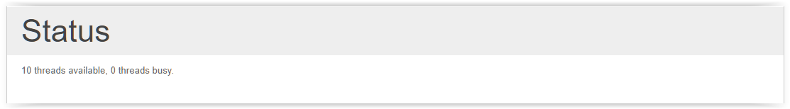

# Status

In some cases, you might want to run a higher number of jobs at the same time, or some jobs that take significally longer. In that case, this section indicates how many threads are currently occupied by jobs currently running, out of a maximum of 10.

