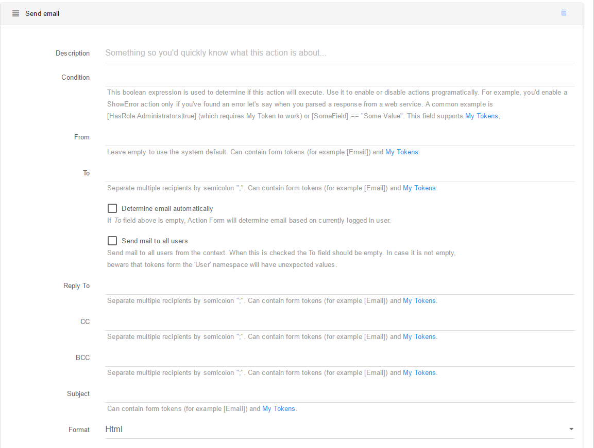

# Send Email

This action does exactly what its name says. It sends an email using the SMTP server that is defined in DNN Host Settings. The following fields can be configured: 

**From** This is the sender of the email as it will appear to the recipient. Leave empty to use the system default – if a portal context is set, the portal administrator email is used; otherwise, the email defined in Host Settings is used. This field supports context tokens and My Tokens.

**To** Determines who receives the email. Separate multiple email addressed by semicolon. If the Determine Automatically option is used, then Sharp Scheduler tries to infer the email from the Context User. This field supports context tokens and My Tokens.

**Reply To** When the recipient of the email replies to this email, the To field fills with this email instead of the original From. This only makes sense when sending emails to non-admin users that are likely to reply to those emails. For example, it can be a trial reminder email. Separate multiple email addressed by semicolon. This field supports context tokens and My Tokens.

**Subject** Used as email subject. For the best experience, choose something relevant to the message you are sending. This field supports context tokens and My Tokens.

**Body** This is the email content. If you need custom data then use other actions, for example the Run SQL action, to fetch it and store it in the job context. Then access it through the context tokens. This field also supports My Tokens.

**Attachments** This action allows you to add up to 5 email attachments to the email. If a Portal Context is specified, then the file picker will show files that belong to that portal; otherwise, files from the Host folder are listed.

