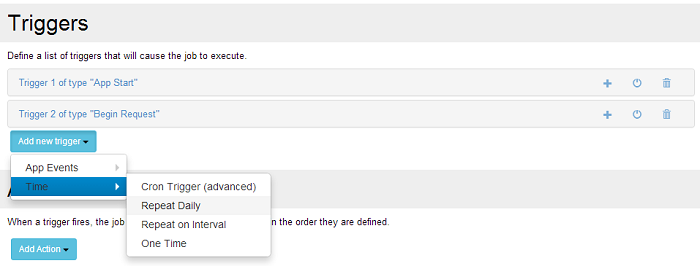
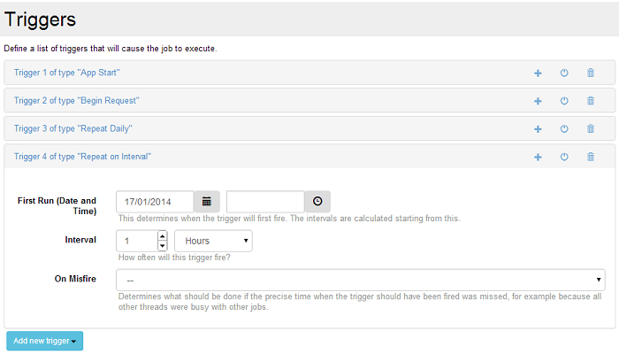

# Time Triggers

Time triggers are specific time moments when the job is scheduled to execute its actions.  They are commonly suited for repetitive tasks like cleaning, reporting, making a backup, etc. The supported types are:
* One time; Triggered only once, at the specified time ;
* Repeat daily; Triggered daily, at a specified time, in the specified week days ;
* Repeat on Interval; Triggered at the specified time interval, the previous type is a particular case of this one (the interval being 24 hours) ;
* Cron trigger (advanced) - this is the most complex one as it can specify most unusual and granular time intervals. It uses cron expressions, used often on Unix systems to define any kind of interval.

One specific property of  time triggers is the misfire policy: It defines what to do in case a scheduled event is missed. It can be missed if the module is not running (it happens in the real world: power off, crash, machine restart, etc.), when there are no free threads to execute it or when the task is already running. Two options are available for the moment: ignore the missed task ("Do nothing") or execute it when the module is ready again ("Fire now").

