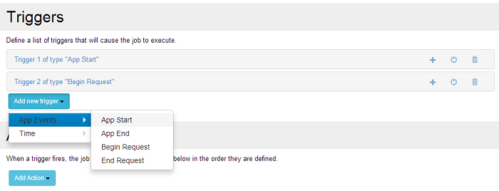

# App Events

The application events are those related to the Dot Net Nuke instance. While the http service (IIS) can have several DNN instances, a particular DNN instance has a unique Sharp Scheduler module, no matter how many portals it serves. Therefore, the Sharp Scheduler module is a per host module as opposed to per portal.

**The supported application events are:**
* App Start 
  - Triggered when the current DNN instance starts ;
* App End
  - Triggered before the DNN instance is shutdown by IIS ;
* Begin Request 
  - Before a http request begins in the current DNN instance ;
* End Request 
  - After a http request ends in the current DNN instance

The App events can be added through the "Add new trigger" drop-down button (see screenshot below). 

