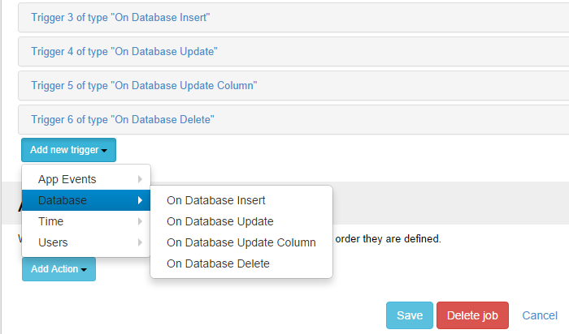

# Database Triggers

The database triggers are automatically executed in response to certain events in a database, when an entry is inserted, updated or deleted from the database. They can be used when there is a need to perform a certain action as a result of an ``INSERT``, ``UPDATE`` or ``DELETE``. This opens the doors to unlimited possibilities.

The supported database events are:

* On Database Insert:
    * triggers when data is inserted into a table. The job is fired once for every inserted row ;
* On Database Update:
    * triggers when data is updated into a table. The job is fired once for every row that was updated ;
* On Database Update Column:
    * triggers when data is updated into a named column. The job is fired once for every row that was updated ;
* On Database Delete:
    * triggers when data is deleted from a table. The job is fired once for every deleted row.

Notice that the tokens are built automatically using column names, so you can reference inserted, updated or deleted values inside actions using ``[ColumnName]`` token syntax. You also get the original value using the ``[ColumnName:Before]`` syntax.

Starting with version [05.00.50](https://www.dnnsharp.com/products/download?p=SCHD&v=05.00.48) you can use the token **[Row:JsonData]** to see the full row information about the changes in a JSON format, like in the following example:

If you need only the changed columns, you can use the **[Row:ModifiedJsonData]** token which will bring a JSON list like in the below format, but containing only the columns where the values have been modified.

```json
[
    {
        "ColumnName": "<Other_Column_Name>",
        "OldValue": "Some old value",
        "NewValue": "New column value"
    },
    {
        "ColumnName": "<Another_Column_Name>",
        "OldValue": "Some old value",
        "NewValue": "New column value"
    }
]
```

On **insert**, the ``OldValue`` property will be null, like in the following example:

```json
[
    {
        "ColumnName": "<Other_Column_Name>",
        "OldValue": null,
        "NewValue": "Newly inserted value"
    },
    {
        "ColumnName": "<Another_Column_Name>",
        "OldValue": null,
        "NewValue": "New column value"
    }
]
```



Notes:

* You can not use **text / ntext / image / timestamp** SQL column types for Database Update Column ( they are actually [deprecated](https://stackoverflow.com/a/1935709/443379){:target="_blank"} since SQL Server 2005)
* If you use a column token with the value ``NULL`` keep in mind that the tokenization result is actually a empty string. In order to have *NULL* as tokenization result, set first action an *Inject Data* with condition ``[ColumnName] == ""`` and in Data an element with name *ColumnName* and value ``NULL``.