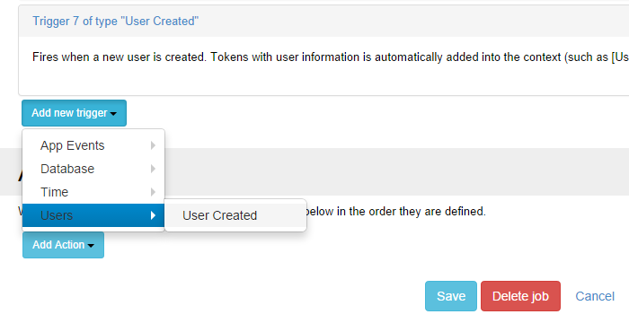

# User Triggers

## On User Created

On user created trigger is based on database triggers and it fires when a new user is created. Notice that tokens with user information is automatically added into the context (such as ``[UserId], [UserName], [FirstName], [LastName], [Email], [DisplayName]``) .

