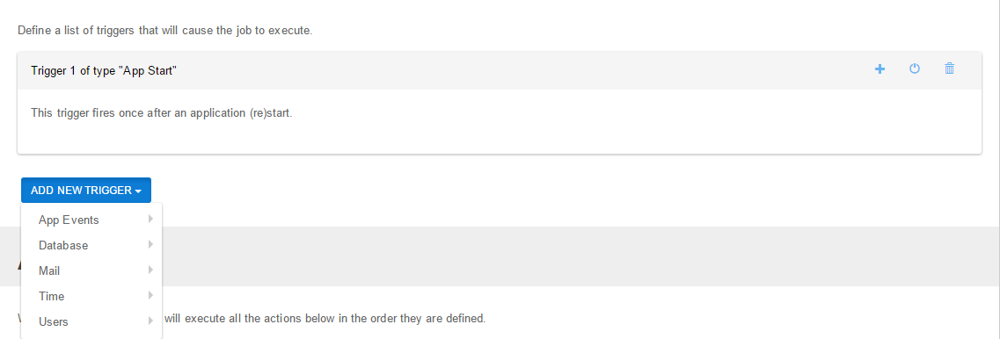

# Triggers

## What is a trigger?

A trigger is an event that will start executing all the actions assigned to the Job. In short, a job is a combination of triggers and actions. More simpler, ACTIONS decide WHAT to execute and TRIGGERS decide WHEN to execute the job. The execution is serialized, this basically means that you can create as many Jobs as you want, and they can be executed in the same time if there is any thread available. A maximum of 10 jobs can be executed in the same time. We strongly recommend you to create a separate job for every action, this way it's better to keep track of what job was executed and when. Also, it will reduce the CPU utilization.

## What types of triggers are there?

There are five types of triggers: App Events, Database, Mail, Time and User. The time-dependent are the classic scheduler events, that will automatically do repetitive tasks (there's also a "One time" only trigger), at convenient times. The database-based triggers automatically when an event occurs in the database (when an entry is inserted, updated or deleted from the database). The application-based triggers are related to the Dot Net Nuke module in the Internet Information Services (IIS) service: the moments when the module is started or ended (a machine or server restart) or when a http transaction begins or finishes. On user created trigger is based on database triggers and it fires when a new user is created. POP Mail trigger is fired each time an email is received.

## What are the misfire instructions?

The time-based triggers can be missed if the module is not running (it happens in the real world: power off, crash, machine restart, etc.), when there are no free threads to execute it or when the task is already running. Two options are available for the moment: ignore the missed task ("Do nothing") or execute it when the module is ready again ("Fire now").

## How to add a new trigger

As you can see, the triggers can be added from the "Add new trigger" dropdown button, where the triggers are grouped by their category. The triggers can be disabled or even deleted from the right little buttons (no text, only the nice icons). The modifications will be applied only after saving them by using the "Save" button (it can be find at the bottom of the page, but also in the top right corner). You can even delete the entire job if you want by clicking the "Delete job" button, a confirmation dialog will follow. The triggers cannot be reordered for the moment, we see no use for this right now.
