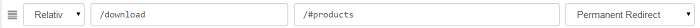

# Examples

## How to redirect `http://site.com` to `http://www.site.com`

There are two methods in which this can be achieved:

1. Use the `Portal Aliases` settings to choose how the site is accessed:
    * When it is set to `any` both URL types are accepted.
    * When it is set to `www` only `www.` URLs will be accepted and redirects will be made to accomplish that.
        * **Note:** when this option is selected a check-box will show up that changes the behavior for sub-domains. When that option is checked sub-domains will be accessible without the `www.` in front of them.
    * When it is set to `non-www` only URLs without `www.` will be accepted.

* Use the `Advanced Rules` settings:
    * When you need to redirect a site or any URLs which are not using `www.` and you want to force them to use `www.` for all `http://` or `https://` calls, then you need to create an Advanced Rule in URL Adapter like:
    
    ```
    Match In: Absolute URL
    Condition: http://site.com/{*}
    Target URL: http://www.site.com{*}
    Type: Redirect
    ```
    
    
    
    * In this way, only the specified portal will be "affected" by the advanced rule, and if you have, for example, other portals like `http://blog.site.com`, it will remain without `www`.
    
## Redirects to `https://`

URL Adapter also provides the ability to redirect all `http://` traffic to `https://` - it respects the HTTPS settings made in DNN (Admin > Site Settings and page settings), therefore, pages checked as secured should be served with `https://`.

There is also an advanced rule if you want to redirect from `http://` to `https://` without relying on DNN settings:
```
Match In: Absolute URL
Condition: http://site.com/{*path}
Target URL: https://www.site.com{*path}
Type: Redirect
```

## How to rewrite an URL

If you want a shiny new URL there are two steps you need to make in Advanced Rules:

1. Firstly, a Redirect rule is needed from A to B
        use the Relative Path in Match In section
        Condition: /resources/news?tabid=275&artmid=1255&articleid=5
        Target URL: /resources/news/ServiceProvider

2. Then, you need to Rewrite from B to A so behind the scene it renders the `/resources/news?tabid=275&artmid=1255&articleid=5` page:
        Condition: /resources/news/ServiceProvider
        Target URL: /resources/news?tabid=275&artmid=1255&articleid=5

## When there's a # in the URL

This is an important note to be made, in Condition the # inside an URL will not be recognized and there might be some problems in recognizing the entire URL, but if you want to make a redirect/rewrite to a link which has # inside it, Target URL accepts it.



## How to use a Token in an Advanced Rules

A simple basic example is to manually create a token with an URL inside the Constant String and use it in Target URL to make a redirect. 

