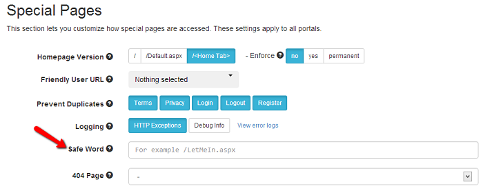

# Locked Out?

It's not difficult to get yourself locked out in URL Adapter. This could happen for example if you write a rewrite rule that matches all requests or your write a redirect to a page which redirects back to the initial page, thus resulting in an infinite loop. These are two obvious scenarios. In real world other more obfuscated situations will arise. You must be prepared to handle this and get access back.

There are 3 methods we officially support for this purpose.

## Use the API Reset Method (preferred)

This is an API method that will reset all URL Adapter settings and revert to the DNN provider. This is a more drastic method because you will lose all the settings, but it's handy when nothing else works or you've missed to setup the Safe Word option. The API can also be invoked by super users and it optionally accepts a username and a password because it could be that you can no longer access the site log in form.

The API can be invoked by accessing the following URL in your browser:

    http://example.com/DesktopModules/DnnSharp/SeoUrlAdapter/AdminApi.ashx?method=Reset&username=host&password=password

After this, the URLs will switch back to the standard format, so if you get 404 errors make sure to navigate back to the root domain find your way from there.

\* Make sure you put in the URL you personal access details (domain, username and password). 

## Using the Safe Word Option

This option can be configured from the [Special Pages](settings-reference/special-pages){:target="_blank"} section. When you open the browser at the safe address, you'll be redirected to the homepage and URL Adapter will be permanently disabled.

{:target="_blank"}

## Manually Update Database Tables

If you're not afraid to get your hands dirty, you can go directly into the database and update the tables manually. The relevant tables are `DnnSharp_SeoUrlAdapter_UrlSettings`, `DnnSharp_SeoUrlAdapter_TabUrls` and `DnnSharp_SeoUrlAdapter_Rules`. Note that data is cached, so any change you made won't be reflected immediately on the site. So make sure to refresh the site cache.

## Undo web.config

If everything else fails, you can disable URL Adapter manually to get access back to your website. This is done from `web.config` file. If you have a backup, you can just copy it back over the original. If not, do not despair. You can make the changes manually.

1. First, undo the HTTP Module that does the rewrite. Find the line below:
```xml
<system.webServer>
    <modules>
      <add name="UrlRewrite" 
           type="DnnSharp.SeoUrlAdapter.Core.Rewrite.UrlAdapterRewriter,DnnSharp.SeoUrlAdapter.Core" />
       ... the rest of HTTP modules ....
    </modules>
</system.webServer>
```
And replace it with:
```xml
<system.webServer>
    <modules>
      <add name="UrlRewrite" 
           type="DotNetNuke.HttpModules.UrlRewriteModule, DotNetNuke.HttpModules" preCondition="managedHandler" />
       ... the rest of HTTP modules ....
    </modules>
</system.webServer>
```
Note that on older IIS you'd have to do the same for the `system.web/httpModules` section.

2. Next, you have to switch the URL Provider back to the default. Find the `dotnetnuke/friendlyUrl` section. Most likely it will look like this:
```xml
<dotnetnuke>
  <friendlyUrl defaultProvider="SeoUrlAdapter">
    <providers>
      <clear />
      <add name="DNNFriendlyUrl" 
           type="DotNetNuke.Services.Url.FriendlyUrl.DNNFriendlyUrlProvider, DotNetNuke.HttpModules" 
           includePageName="true" 
           regexMatch="[^a-zA-Z0-9 _-]" 
           urlFormat="humanfriendly" />
      <add name="SeoUrlAdapter" 
           type="DnnSharp.SeoUrlAdapter.Core.SeoUrlAdapterProvider, DnnSharp.SeoUrlAdapter.Core" 
           includePageName="true" 
           regexMatch="[^a-zA-Z0-9 _-]" 
           urlFormat="humanfriendly" />
    </providers>
  </friendlyUrl>
</dotnetnuke>
```
All you have to do is replace `defaultProvider="SeoUrlAdapter"` with `defaultProvider="DNNFriendlyUrl"`.

This will revert to using the standard URL Rewriter, so you can get back into the site and sort out the underlying issues.

<br /><br />

You can also check the video below to see how to reset URL Adapter.
[](https://www.youtube.com/watch?v=HZnoR4uY7l0){:target="_blank"}