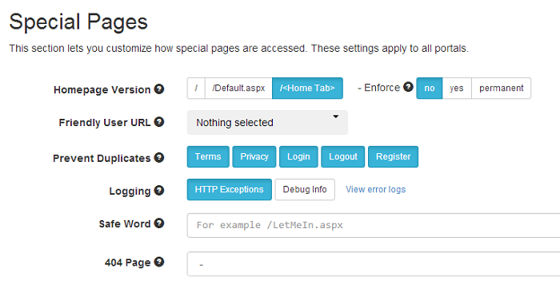
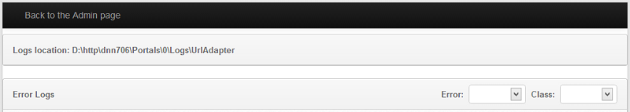
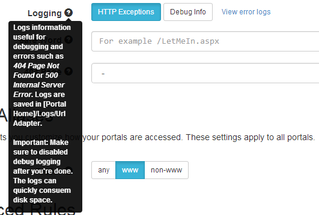

# Logging

URL Adapter comes with 2 levels of logging. One is to log HTTP Exceptions which is useful, for example, to identify broken links or errors happening on your site. The other is to log Debug Information that is useful for troubleshooting.

## Log HTTP Exceptions

URL Adapter can log all HTTP errors such as 404 (Page Not Found) or 500 (Internal Server Error). The logs are saved in `[Portal Home]/Logs/UrlAdapter` (full path showed in the "View logs" page). This option is very useful to see which pages are causing problems at a glance and take action.

The option to turn on logging is located in the Special Pages section from the module.
{:target="_blank"}

Right next to the HTTP Exceptions Logging button you'll find the link to view the reports. Clicking that button will open the screen below where you can filter the entries in report by error or by category of errors.

{:target="_blank"}

## Testing

You can test the logging by calling a special script we've created, as follows 

`example.com/DesktopModules/DnnSharp/SeoUrlAdapter/ThrowError.aspx?code=500`

Note that you have to be logged in with an Administrator user in order to access this script.

## Debug Logging

This feature was added in version 1.2. When enabled, it logs detailed information about each request and how each URL is formed. Use it to troubleshoot problems related to URLs.

The logs information are saved in `/Portals/_default/Logs/UrlAdapter` and `/Portals/[PortalId]/Logs/UrlAdapter`. The reason for having 2 folders is that until it determines what portal the current request runs on, URL Adapter logs the information under the _default folder.

**Important!** Logs can get quite big, rapidly consuming the disk space on the server. Make sure to disable this option when you finish the debugging session.