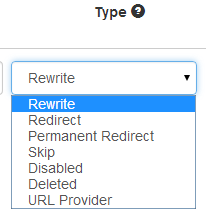

# Redirects and Rewrites

While working with URL Adapter one can get quite confused about various types of actions that can be performed on URLs. This section will explain all the concepts and how they are generally applied on the web, in DotNetNuke or in URL Adapter.

## What is the difference between Rewriting and Redirecting?

When our grandmas asked us this question, we told them that when a redirection happens, the browser address bar will update to show the new URL. When a rewriting happens, the browser address bar remains with the original URL, even though the page showed inside the browser is the new page.

Technically, redirects happen on the client side. The server returns an HTTP code that the browser interprets as an instruction to perform a redirect. Rewrites on the other hand are transparent for the browsers or other web clients. They happen on the server. A component will check if current URL needs rewriting, and if so, it changes the URL in a way that all the other server components will actually see the new URL.

So, rewriting is transparent even for search engine crawlers, and that's why it's so helpful for SEO. One can rewrite a URL like:

from `example.com?pageId=3` to `example.com/about-redirects`. Guess which one will come up higher when you search for "redirects"?

## How many redirect types are there? And what are permanent redirects?

Before going into this question, some notes on HTTP codes are necessary. Whenever a browser requests a page from a server, the server also returns a response code. These codes represent numbers that tell browsers the status of the page. Most of the time the HTTP code is 200 which means "OK, here's the page".

Redirects are also implemented with HTTP codes. There are plain redirects that have the 302 HTTP code, and permanent redirects that have the 301 code. The difference between them is in the semantics. When browsers and other client apps receive a 301 Moved Permanently code, they should update their indexes, bookmarks and other stored URLs to the new URL.

A 302 redirect only says that the browser or the client app should redirect to another page. It could be a redirect only for a specific user, happening on a particular action, etc. It's not a permanent condition that applies to all requests.

## Other related settings in URL Adapter

In URL Adapter most of the time you'll directly rewrite or redirect one URL to another, but there are other few settings to tune this replacement engine further.

**Permanent Redirect** - With permanent redirects, the browser heavily caches the URLs and make development and testing unpredictable. We recommend to always use plain redirects while configuring and only switch to permanent redirects when you are done. The only reliable way to clear this in Chrome browser is with F12 > right click the fresh button at the top > choose 3rd option "Empty cache and Hard Reload".

**Skip** option will ignore the rule created and will not execute it.

**Disabled URLs** basically means that URL Adapter should never serve this URL. What it does, it looks for an alternative - that is a primary or a default URL. This is different that enforcing a URL, where all other URLs will point to the primary one. The disabled URL only applies for one URL.

**Deleted** - this option is used to remove the created rule - make sure that after you set it on a rule you click on the "Save Changes" button. 

**URL Provider**

