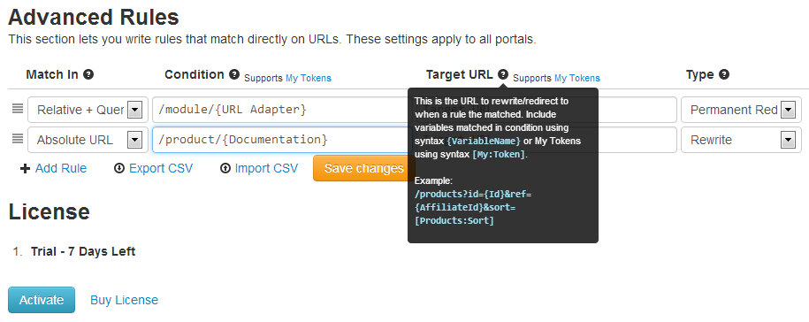

# Advanced Rules

This section lets you write rules that match directly against URLs. They are per host, so apply to all URLs regardless of which is the current portal. Later on, we'll plan to also add Advanced Rules per portal.

In many cases they can be interchanged with Custom Rules. The difference is that with Advanced Rules you'd normally target a class of redirects with one rule, while with Custom Rules you'd do one at a time. If you end up doing one Advanced Rule for every redirect, and these refer to DNN pages, it's highly recommended to switch to Custom Rules as it may perform faster and be easier to understand.

Here are just a few cases when Advanced Rules are most appropriate:
* **Redirect a class of URLs**
 For example, redirect all incoming request from `/products.aspx?id={id}` to `/we-re-out-of-stock.aspx`

* **Rewrite a class of URLs**
 Note that when you're doing rewriting through Advanced Rules, you'll most likely end up with 2 rules: one redirecting from old url to new url, one one that rewrites the new url to old url.
For example, originally you had `/articles.aspx?title=My Article` and you wish to use `/articles/My article.aspx` instead. First, write a redirect rule that sends the users to the new page. Then, a second rule will rewrite the rule, so even if the browser address bar displays `/articles/My article.aspx`, in fact the server components see the original `/articles.aspx?title=My Article` which they can handle.

* **Domain redirect**
 So you've changed domain from `old-unattractive.com` to `new-cool.com`? Write a rule to permanently redirect traffic to the exact path on the new domain.

* **Pass Query String parameters**
 The Custom Rules will map to a page and you don't have the ability to pass additional parameters in query string. This may change in the future, but if this is the case, then you'll need Advanced Rules.

As you probably already guessed, the pattern supports some light regular expressions, to be explained shortly, and is also integrated with My Tokens module. At the bottom of the list you'll find buttons for adding new rules, for importing and exporting them in CSV format and for saving the modifications ("Save changes" appears with the first change and must be used to apply the modifications). 

## Settings Explained

### Match In

The first column determines what to match against: 

* **Absolute** - URL Full URL as it appears in browser address bar, including http://. 
* **Schemeless URL** - Full URL without protocol. 
* **Domain** - Looks only in domain name. 
* **Portal Alias** - Usually it is the domain name, but for child portals or virtual IIS directories it can also include a root folder. 
* **Relative Path** - Looks at the relative path, starting after domain name and until the query string begins (for example `/page/subapge.aspx`). 
* **Relative + Query** - Same as above, except it also includes the query string (for example `/page/subapge.aspx?q=test`). 
* **Portal Path** - Same as Relative Path, except this is relative to the portal alias (it makes sense when dealing with child portals or virtual IIS directories). 
* **Portal + Query** - Same as above, except it also includes the query string. 
* **Query** - Only compare against the query string (for example `q1=test&q2=7`). 

### Condition 

If URL Adapter matches this condition then it rewrites/redirects to Target URL. A simple example: `/products/{Name}`. This fields has special syntax to better match patterns. In the end it uses Regular Expressions, but this is transparent for the Administrator. We've implemented simplified syntax to hide the complexity of Regular Expressions and provide a simple, yet powerful language that everyone can understand.

Here is the basic syntax constructs.
* **{MyParam}**
 This is the most unit. It matches a text without separator and store it in variable `MyParam`. 
For example, use `/products/{name}/etc.aspx` to match `/products/cool-product/etc.aspx`. The `{name}` parameter will contain "cool-product" and can be referenced inside the Target URL field.

* **{MyParam:number}**
 This is the same as  above, except it validates that the parameter is a number. Using a condition like `/product/{id:number}/etc.aspx` will match an URL like `/product/1/etc.aspx` but not `/product/new-release/etc.aspx`. Most of the time this is not something critical to a website or application, but it's an easy way to return a 404 error instead of showing an error that the product ID is not in correct format.

* **{MyParam*}**
 This construct matched a text, including path separators. 
Consider the following condition: `/folder/{path*}.aspx`. This will match URLs like `/folder/my-documents.aspx` but also `/folder/my-pictures/last-summer.aspx`. The `{path*}` parameter will contain "my-documents" in first case and "my-pictures/last-summer" in second case. Note that when you use this parameter in the Target URL, you have to keep the asterisk, so it appears exactly as it is in the Condition field.

* **{*}**
 This is the same as `{MyParam*}`, except that you don't care about storing the matched pattern. It matches any sequence of characters. For example, `/product/{*}` matches any URL that starts with `/products/`.

* **{MyParam:[My:Tkn(Check=[Value])]}**
 This one is a little bit more complicated. Match a text without separator, invoke the token, you can pass to the token the matched value with the `[Value]` token, and if the token returns true or "1", then there is a match and the matched value is stored in variable `MyParam`.
You can use `*` to match separators, example: `{MyParam*:[My:Tkn(Check=[Value])]}`.

### Target URL

This is the URL to rewrite/redirect to when a rule is matched. You can include any variables that you previously matched, such as `{VariableName}` or `{VariableName*}`. You can also use My Tokens using syntax `[My:Token]`. Example: 

`/products?id={Id}&ref={AffiliateId}&sort=[Products:Sort]`. 

### Type

Defines what happens when the condition is matched:

* **Rewrite**
 The URL is rewritten so all components see it as Target URL.

* **Redirect**
 Redirects to URL specified in Target URL. This option also works to redirect to external sites.

* **Permanent Redirect**
 Same as above, except the redirection is permanent (301 HTTP Code).

* **Skip**
 URL Adapter will stop evaluating the rest of the rules.

* **Disabled**
 This rule is disabled. URL Adapter will not evaluate it.

* **Deleted**
 The rule will be deleted on submit.

### Priority

This box is enabled by default whenever you want to add a rule. The advanced rules which have this option enabled will take priority over other rules, so, for example, if you want `/home.aspx` to redirect to, let's say, `/about-us.aspx` page, and you create a redirect advanced rule for this but you don't check the Priority box, then when you'll access `/home.aspx`, the homepage will be displayed, the redirect will not be made.

**NOTE:** Please note that whenever you have created an advanced rule wit curly brackets in root, for example:

    Condition: /{affiliate}
    Target URL: /home?affiliate={affiliate}
    Type: Redirect

then, when you click on Log Out button, in order for this action to be correctly executed, you have to disable the Priority box for this rule with curly brackets. This advice also applies for the cases when you are unable to edit pages, to navigate on other pages etc. 