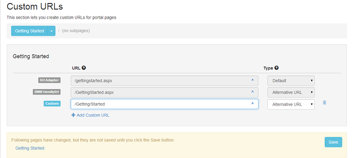

# Custom URLs

The section lets you create custom URLs for your DotNetNuke pages. It applies to individual pages. After you select a page  - by using the "Select portal page" drop down list, the section will have two components: the selected (sub)page and the available URLs for that particular page. At first, there is no "Save" button, its display will be triggered with the first change. In the attached sample, you can see the "Getting Started" page having three equivalent names:

As you can see, the first two rows are the URLs formatted by the URL adapter, respectively by the default DotNetNuke adapter. The latter can't be configured, the previous is customizable by the Friendly URLs section, not by this one, so they both appear as read-only, including the type column. Your custom URLs follow, with the names having no constriction. You can create your custom URLs by clicking the "Add Custom URL" button. 



The significance of the types in the next column is as follows:

* **Default**
<br />This is the default provider configured in the Friendly URL settings (the previous section). If no custom URL matches, then this URL will be used. This is the only one that cannot be selected, being generated by the default URL rewriter provider (URL Adapter or DNNFriendlyURL).

* **Alternative URL**
<br />This is an alternative URL where the page loads. 

* **Primary URL**
<br />This is the URL that will appear in the menus and other places on the site.

* **Primary URL (redirect)**
<br />This is the only URL where the page can be accessed. Other URLs will redirect to this one.

* **Primary URL (permanent redirect)**
<br />Same as above, except the redirect is permanent (301 HTTP Code).

* **Disabled**
<br />Requests to this URL result in a redirect to the primary URL.

* **Deleted (Gone 410)**
<br />Requests to this URL result in a "410 Gone" HTTP request.

Every URL column ends with an icon "^" which, when clicked, opens the link in a new window. For custom URLs, there's also a delete button with the "recycle bin" icon that deletes the selected custom URL, although the status "Deleted (Gone 410)" is generally more appropriate because of SEO. It allows search engines crawlers to notice that the page was deleted.

**Note:** If the custom URL that you want to use contains a dot on the last part of the URL (example: `/path/my-custom-url.custom`) IIS will treat it as a file so a handler must be setup for that file type. In `web.config` in `configuration > system.webServer > handlers` you need to add the following line:
```xml
<add name="URLAdapter-handleCustom" path="*.custom" verb="*" type="System.Web.UI.PageHandlerFactory" preCondition="integratedMode" />
```
The name of the rule needs to start with `URLAdapter-` and the path is used to specify the file type you want to handle. For URLs that simulate html pages use `path="*.html"`