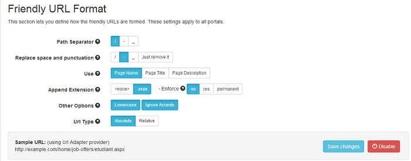

# Friendly URLs

The section defines the generic rules to decorate your friendly URLs with separators, punctuation, extension, lowercase, etc. As in the other sections you will find enforce options: "no", "yes" and "permanent". The difference between the last two is that in the HTTP status code returned, "yes" is 302 and "permanent" is 301 (Moved Permanently), the last one being particularly helpful for SEO ranking.

After you click on the "Change" button, this section will look like in the image below. The button will change the label into "Save changes" and you have to use it if you want to have the settings applied on the server.

You can see an area with a Sample URL at the bottom of the section that updates in real time based on your changes. In this particular example, `http://example.com/Home/Job-Offers/Etudiant.aspx`, the following settings were applied: 
* '/' as path separator (for '_' it looks like `http://example.com/Home_Job-Offers_Etudiant.aspx`)
* space replaced (for '_' it will be `http://example.com/Home/Job_Offers/Etudiant.aspx`)
* extension applied
* lowercase not enforced
* accents ignored (`étudiant`).

And now let's take a closer look to each option.
* **Path Separator**
 In localized environments the language will be always separated with '/'. Examples: `/en-us/page/subpage/subsubpage` or `/fr-fr/page-subpage-subsubpage` or `/en-au/page_subpage_subsubpage`

* **Replace space and punctuation**
 Example: `/page.subpage subsubpage` becomes `/page/subpage/subsubpage` or `/page-subpage-subsubpage` or `/page_subpage_subsubpage` or `/pagesubpagesubsubpage`

* **Page Part**
 Choose what part of page to use when building URLs. You can choose between page name, page title and page description. These are defined in DNN Page Settings. Note that when a description is empty it will fallback to the page title.

* **Append extension**
 Choose whether you want `.aspx` extension in your URLs.
 **Important!** Make sure your server supports extensionless URLs. 

* **Enforce extension** (no, yes, permanent)
 This option determines either URL Adapter will enforce this setting. If it's not enforced, then the pages can be accessed on both variants. When enforced, it can either be a 302 redirect (using the yes option) or a 302 permanent redirect (using the permanent option).

* **Other options**
 Some applications can think of URLs as being different if they vary in case. Usually you do not want this and you can configure them to be all lowercase. Moreover, in some languages, even though they have accents, they are not commonly used in domain names and you have the option to replace them with their Latin equivalent.

* **Default provider**
 DNN comes with its own minimal URL rewriting provider: DNNFriendlyUrl. It is advisable for you to always use SeoUrlAdapter, however you can switch to DNNFriendlyUrl at any time. Note that still UrlAdapter will be the default URL provider, but it will call the DNN provider to get the "raw" URLs.

* **URL type**
 This option allows you to choose whether you want absolute or relative URLs. Be aware that some components, like the Facebook authentication provider works only with absolute URLs!

* **Enforce provider**
 This option determines if either URL Adapter will enforce this setting. If it's not enforced, then pages can be accessed on both variants generated by the standard URL provider or the URL Adapter provider. When enforced, it can either be a 302 redirect (using the yes option) or a 302 permanent redirect (using the permanent option). Read more about redirects and rewrites.