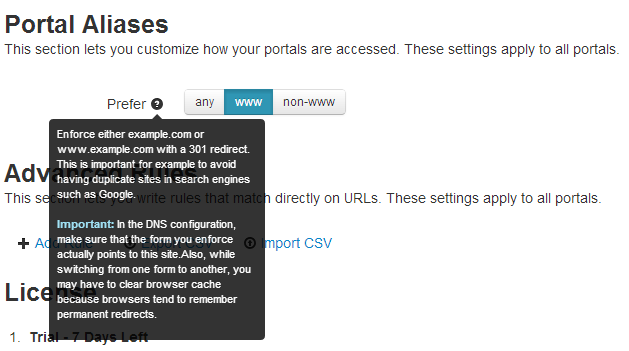

# Portal Aliases

This section lets you customize how your portals are accessed. These settings apply to all portals.

As you can see in the screen capture above, there is only one setting: choose between `www / non-www` URL versions or accept both. The redirection from one to another is made by using the **301 (Move Permanently)** redirect. 

The "Save" button will appear after the first change.