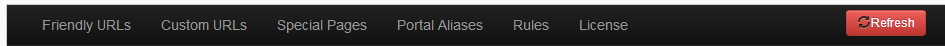

# Settings Reference

After you add the URL Adapter module on a page, it will show you the configuration options right away. Note that URL Adapter has an extra protection and it will show an Access Denied message if current users don't have admin access.

URL Adapter starts with default settings that cover most of the basic scenarios. First thing you will notice is the navigation bar at the top which will remain fixed at the top while you scroll the page. Use it to navigate quickly between all the configuration sections.

As you scroll down through the admin, you'll notice that each section has a brief description. These are also highlighted on this page below, each with a link to a more detailed documentation page.

Important Remember to save your changes, every section has its own "Save" button !

* [**Friendly URLs**](friendly_urls.html){:target="_blank"}
 The section defines the generic rules to decorate your friendly URLs: separators, punctuation, extension, lowercase, etc. As in the other sections you will find the enforce options: "no", "yes" and "permanent". The difference between the last two is in the HTTP status code returned: "yes" is 302 and "permanent" is 301 (Moved Permanently), the last one being particularly helpful for SEO ranking.

* [**Custom URLs**](custom_urls.html){:target="_blank"}
 Allows you to define other (custom) URLs to link to your main pages, with different types of connections between them: alternative URL, primary URL (with and without redirection), disabled, etc. This is the only section that does not apply to all portals, but only to the customized URLs.

* [**Special pages**](special_pages.html){:target="_blank"}
 Helps you configure standard pages like Home, user pages and also some security and debugging settings.

* [**Portal aliases**](portal_aliases.html){:target="_blank"}
 Lets you customize how your portals are accessed.

* [**Advanced rules**](advanced_rules.html){:target="_blank"}
 Regular expression rules that apply to large classes of page names.

* **License**
 Manages the URL Adapter module's license.

While normally not needed, the **Refresh** button can assist you in being sure that the site is using URLs based on the latest settings and not a cached version. URL Adapter basically builds an index of pages in memory so access to the pages is very fast.