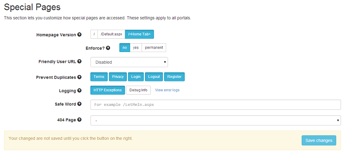

# Special Pages

This section lets you customize how special pages (like home or users pages) are accessed. Let's take a look and then comment on each setting:

* **Homepage Version**
 Choose the preferred home page, DNN offers three different versions (not good for SEO): `/ (root)`, `/Default.aspx`, `/Home.aspx`. 
 Optionally, enforce the preferred version. If it's not enforced, then the homepage can be accessed on all variants. When enforced, it can either be a 302 redirect (using the yes option) or a 302 permanent redirect (using the *permanent* option).

* **Friendly User URL**
 Build friendly URLs for your user by using their username (or ID, or display name) or a profile property. Optionally specify a base URL path so the users would not collide with existing portal pages. If that happens, pages take precedence over users. Optionally, you can enforce the preferred version of user URLs. If it's not enforced, then the user pages can be accessed both on the configured version and on the original DNN version. When enforced, it can either be a 302 redirect (using the yes option) or a 302 permanent redirect (using the *permanent* option). So, when the user access the Profile page, his username (or ID, or display name) or a profile property that you've set, will show up in the URL.

* **Prevent Duplicates**
 Check these ones to avoid having more than one independent URLs to these pages (force 301 redirection) (Example: use only `/terms.aspx` for Terms and redirect `/home.aspx?ctl=terms` to it).

* **Log HTTP Exceptions**
 URL Adapter can log all HTTP errors such as 404 (Page Not Found) or 500 (Internal Server Error). The logs are saved in   `[Portal Home]/Logs/UrlAdapter` (full path showed in the "View error logs" page). This option is very useful to see which pages are causing problems at a glance and take action.

* **Safe Word**
 Configuring rewriting and redirects is a tricky job. There are some settings that can lock yourself out of the portal. Use this setting to define a page that will permanently disable URL Adapter. For example, set it to `/LetMeIn.aspx`, but make it more custom for security purposes.

* **Logging**
 Starting with URL Adapter 1.2 there is this cool new feature. Enabling it, the log information is saved so that you can use it on debugging. The logs information is saved in `[Portal Name]/Logs/UrlAdapter`.  

* **404 Page**
 A good custom 404 page can and will help your visitors to find the information they're looking for, as well as providing other helpful content and encouraging them to explore your site. Starting with URL Adapter 1.2, you can replace the current 404 page with a custom one, set-up and designed the way you want. 